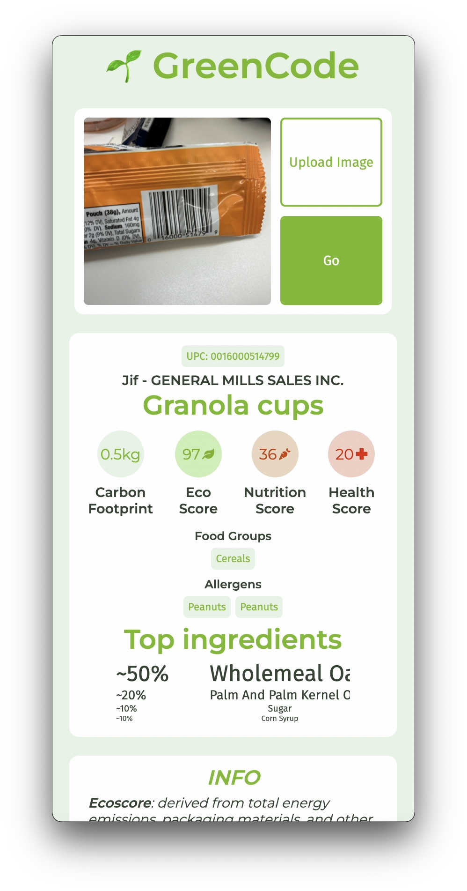

[](https://green-code-app.herokuapp.com/)

# GreenCode: Promoting Informed Consumption

Ever wondered the sustainability behind your favorite snack brands? With Greencode, a quick picture from a smartphone provides an environmental rating as well as ingredients and potential allergens.

<h1 align="center">
    <a href="https://green-code-app.herokuapp.com/"></a>
</h1>

# Features

- Take photos from your mobile device!
- See allergen info easily!
- Look up environmental data (including carbon footprint and environmental impact).
- See health and nutrition info at a glance (nutrition score and health score).

<table>
  <tr>
     <td align="center"><em>Home Page</em></td>
     <td align="center"><em>Take photo</em></td>
  </tr>
  <tr>
    <td></td>
    <td></td>
  </tr>
</table>

<table>
  <tr>
     <td align="center"><em>Bread</em></td>
     <td align="center"><em>Spam</em></td>
  </tr>
  <tr>
    <td></td>
    <td></td>
  </tr>
</table>

<table>
  <tr>
     <td align="center"><em>Upload on iOS</em></td>
  </tr>
  <tr>
    <td></td>
  </tr>
</table>

# About
### Inspiration
Labels on food or snack products are generally misleading, and consumers can miss important information because it printed too small or represented in a confusing way. Additionally, packaging will generally not provide any information on the ethics or environmental sustainability of the products you are buying.

We created Greencode to help consumers make environmentally-conscious and health-conscious purchasing decisions with very little friction.

With Greencode, people can upload an image of the product with its barcode to a web app, and we will instantly find all of the important information you need to know to make an **informed purchase**.

### What it does
Greencode will let you upload an image of your choice, from either your computer or your phone, and search for all of the information that we deemed to be most important. These include:
* The company and product names.
* The food group the product is part of.
* The carbon footprint (in kg) to produce the product.
* An formulated eco-score, based on transportation, a forest score, and a package sustainability.
* A nutrition score based on the FSAm-Npm score standard set by the World Health Organization.
* A health score based on the amount of processing done to the snack item.
* Potential allergens.
* An ingredient list, showing the top ingredients by weight in the product.


# Tech stack

<p>
    
    
    
    
    
</p>


| Frontend |
|---       |
| React    |
| Webpack |
| Styled Components    |
| Font-Awesome Icons    |

| Backend |
|---       |
| Node.js    |
| Express    |
| Axios    |

| DevOps |
|---       |
| Heroku    |

# Local Development

## Setting up the backend

Clone the repository and install npm packages in backend:
```
cd backend
npm install
```

Start the app:
```
node index.js 
```
or start in development mode:
```
npm run dev
```
Visit `https://localhost:3001/`

Done!

## Setting up the frontend (optional)
Install npm packages in backend:
```
cd frontend
npm install
```
Start the frontend
```
npm start
```
Visit `https://localhost:3000/`

Done!
