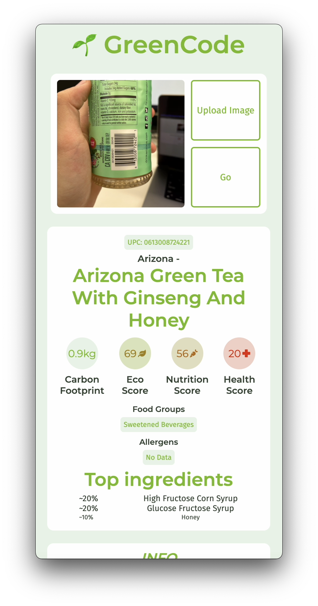
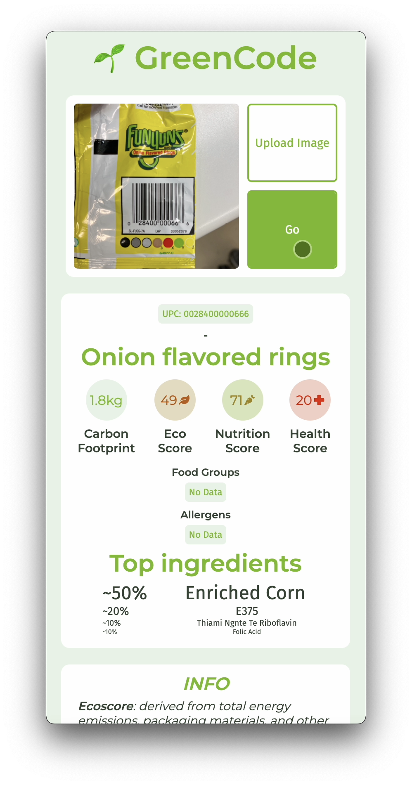

[](https://green-code-app.herokuapp.com/)

# GreenCode: Promoting Informed, Consumption

Ever wondered the sustainability behind your favorite snack brands? With Greencode, a quick picture from a smartphone provides an environmental rating as well as ingredients and potential allergens.

<h1 align="center">
    <a href="https://green-code-app.herokuapp.com/"></a>
</h1>

# Features

- Take photos from your mobile device!
- See allergen info easily!
- Look up environmental data (including carbon footprint and environmental impact).
- See health and nutrition info at a glance (nutrition score and health score).

<table>
  <tr>
     <td align="center"><em>Home Page</em></td>
     <td align="center"><em>Take photo</em></td>
  </tr>
  <tr>
    <td></td>
    <td></td>
  </tr>
</table>

<table>
  <tr>
     <td align="center"><em>Bread</em></td>
     <td align="center"><em>Spam</em></td>
  </tr>
  <tr>
    <td></td>
    <td></td>
  </tr>
</table>

<table>
  <tr>
     <td align="center"><em>Upload on IOS</em></td>
  </tr>
  <tr>
    <td></td>
  </tr>
</table>

# About
I created this project because I wanted to find new music. Finding new music on Spotify is somewhat annoying because the recommendations are usually songs already in my library. I wanted to be able to quickly sift through songs and create playlists with varied taste.


# Tech stack

<p>
    
    
    
    
    
</p>


| Frontend |
|---       |
| React    |
| Webpack |
| Styled Components    |
| Font-Awesome Icons    |

| Backend |
|---       |
| Node.js    |
| Express    |
| Axios    |

| DevOps |
|---       |
| Heroku    |

# Local Development

## Setting up the backend

Clone the repository and install npm packages in backend:
```
cd backend
npm install
```

Start the app:
```
node index.js 
```
or start in development mode:
```
npm run dev
```
Visit `https://localhost:3001/`

Done!

## Setting up the frontend (optional)
Install npm packages in backend:
```
cd frontend
npm install
```
Start the frontend
```
npm start
```
Visit `https://localhost:3000/`

Done!
